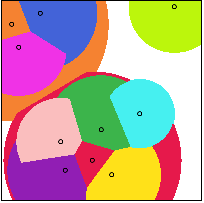

**Interactive demo:**
https://nmamano.github.io/StableMatchingVoronoiDiagram/index.html

# Stable Matching Voronoi Diagrams
Interactive visualizer of Stable Matching Voronoi Diagrams.

Used for the figures in the paper [Stable-Matching Voronoi Diagrams: Combinatorial Complexity and Algorithms](https://arxiv.org/pdf/1804.09411.pdf)
and for the experiments in the paper [Algorithms for Stable Matching and Clustering in a Grid](https://arxiv.org/pdf/1704.02303.pdf).

There are two versions of the code: the javascript version is a simple prototype for a quick interactive demo. The C++ version has many more features, different types of diagrams, different algorithms, benchmarking experiments, and so on.

